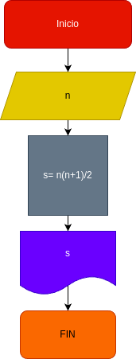

# Suma_n_Numero
suma de los n primero

# Analisis 

## Input

### variables de entrada
n: numero al que se desea aplicar la formula
### prosesing
s: suma de los primeros n numeros 

s= (n*(n+1))/2

### output

# Diseño 
